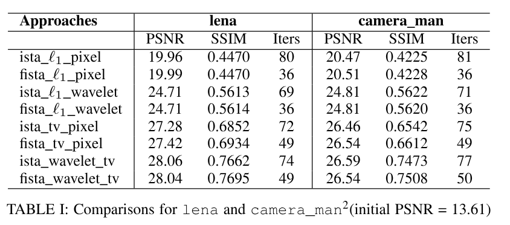
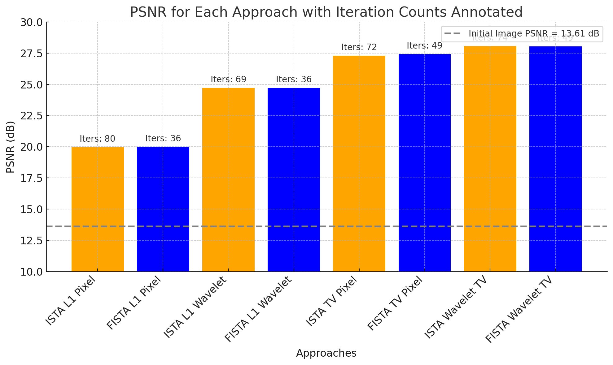
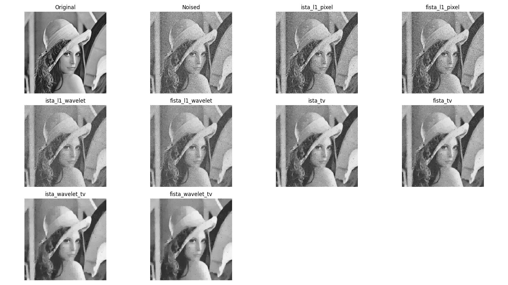
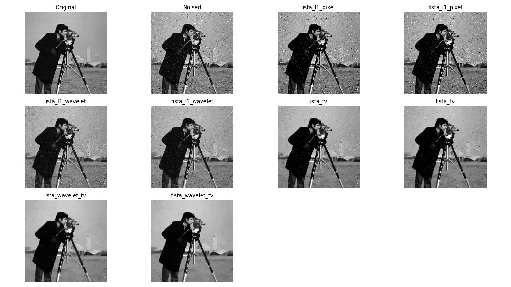
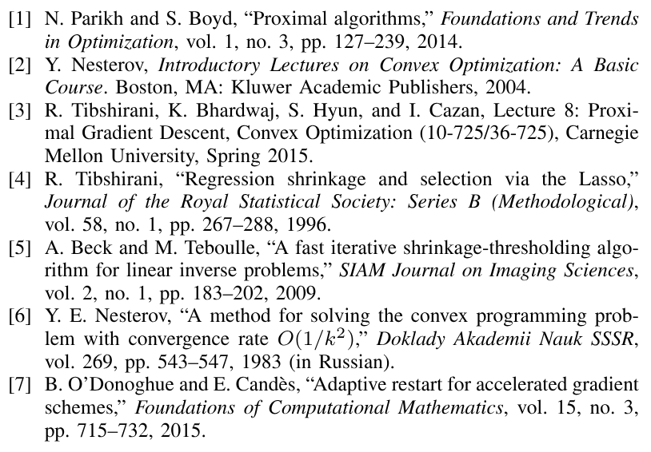

# Convex Project: ISTA and FISTA on image denoise

#### Team members: 
Xiaotian and Rahul

### Project Results
images used are stored in /img/original, and code in /code/

#### Table for denoising PSNR result:

#### Here are the combined denoised images:

Lena:

Camera-man:

##### Additional information
1. The above results were generated form lambda = 0.0625 and L = 20. 
2. We have tried the backtracking approach as well, which outputs very similar / identical combined result, with significantly reduced iteraction counts.
3. But since the iterations counts are reduced by so much, the comparison becomes a bit hard to make (single digit iteration counts for both ISTA and FISTA)
4. So the above results were made with no_backtracking approach, just to test the differences in iteraction and denoising performance.

##### References used
